> **Title: Examination Invigilator Assignment System**
>
> **Table of Contents**
>
> **Introduction**
>
> 1.1 Project Overview Statement……………………………. 7
>
> 1.2 Problem Background…………………………………… 9

1.3 Problem Statement……………………………………… 9

1.4 Proposed Solution……………………………………… 10

1.5 Goals and Objectives…………………………………… 12

> 1.6 Project Scope…………………………………………….14
>
> 1.7. PROJECT LIMITATIONS AND CONSTRAINTS……15
>
> 1.8. FEASIBILITY STUDY…………………………………16
>
> 1.9. PROJECT PLAN………………………………………..23
>
> i\. WORK BREAKDOWN STRUCTURE (WBS)
>
> ii\. GANTT CHARTS
>
> **System Analysis Models**

2.1 Development Methodology …………………………………….27

2.2 User and System Requirements………………………………….29

2.2.1 Functional Requirements…………………………………..31

2.2.2 Non-Functional Requirements…………………………….30

2.3.1 Use Case Diagram……………………………………………..32

2.3.2 Sequence Diagram…………………………………………….33

2.3.3 Activity Diagram……………………………………………..35

> **System Architecture**

3.1 Design system architecture………………………………. ………43

> 3.2 Class Diagram……………………………………………………45
>
> 3.3 Entity Relationship Diagram……………………………………..46
>
> 3.4 Data Flow Diagram…………………………………………….. ..47
>
> **Conclusion** ……………………………………………………………….49
>
> **Reference** …………………………………………………………………50
>
> **List of Figures**

Figure 1 WBS …………………………………………………..24

Figure 2 Gantt Chart ……………………………………………25

Figure 3 Development Methodology……………………………28

Figure 4 Use Case Diagram…………………………………….32

Figure 5 Sequence Diagram……………………………………..33

Figure 6 Login Activity Diagram………………………………..35

Figure 7 Enter Semester Data Activity Diagram………………..36

Figure 8 Retrieve Faculty Data Activity Diagram………………37

Figure 9 Assign Supervisors Activity Diagram…………………38

Figure 10 Conflict Detection Activity Diagram…………………39

Figure 11 Store Final Schedule Activity Diagram……………….40

Figure 12 Send Final Schedule Activity Diagram……………….40

Figure 13 Confirm Final Schedule Activity Diagram …………..41

Figure 14 Design system architecture…………………………..43

Figure 15 Design system architecture…………………………..44

Figure 16 Class Diagram………………………………………..45

Figure 17 Entity Relationship Diagram……………………….46

Figure 18 Data Flow Diagram……………………………….. ..47

Figure 19 Level 0 Diagram……………………………………48

> CHAPTER 1. INTRODUCTION

**1.1 Project Overview Statement**

The **Examination Invigilator Assignment System (EIAS)** is a
comprehensive software solution developed to automate and optimize the
process of assigning faculty members to invigilate exams in educational
institutions. In many universities and colleges, the task of assigning
invigilators (supervisors) to exam sessions is typically done manually
or with basic scheduling tools, which can lead to inefficiencies,
errors, and administrative bottlenecks. The goal of this project is to
replace these manual processes with an intelligent, automated system
that not only improves accuracy but also enhances fairness, efficiency,
and scalability in managing exam invigilators.

**Challenges in the Current System**

In traditional systems, faculty members are manually assigned to
invigilate exams, often based on limited or vague criteria such as
availability or seniority. The existing manual processes face several
challenges, including:

1- Scheduling Conflicts:

> Without automation, it is easy for scheduling conflicts to arise, such
> as double-booking faculty for the same exam session, or scheduling
> exams with overlapping times or in the same room, leading to confusion
> and errors.

2- Inefficient Workload Distribution:

> Faculty assignments may not be fairly distributed across the
> department, potentially overburdening certain individuals while
> underutilizing others.

3- Lack of Transparency:

> Manual systems often lack transparency, making it difficult for
> committee members to track assignments, make adjustments, or assess
> whether the assignment process is equitable and balanced.

4- Time-Consuming Process:

> The manual process of assigning invigilators can be time-consuming,
> especially during peak exam periods, as committee members have to
> cross-reference various documents, schedules, and availability.
>
> **Proposed Solution**: The Examination Invigilator Assignment System
>
> The Examination Invigilator Assignment System seeks to address these
> challenges by automating the entire invigilation assignment process.
> The system is designed to handle the complexity of assigning
> invigilators based on a variety of criteria while ensuring fairness
> and reducing administrative overhead.

**1.2 Problem Background**

In educational institutions, exam invigilation is a critical and
essential task that directly impacts the smooth operation of exams.
Invigilators (or supervisors) play a crucial role in ensuring the
integrity of the examination process, maintaining a controlled
environment during exams, and adhering to institutional policies.
However, assigning the right invigilators to exams is a complex process
that requires careful planning and organization, often involving a
variety of factors such as faculty availability, academic rank, workload
distribution, and room assignments.

Despite its importance, the current process of assigning invigilators is
typically manual and prone to numerous issues, which can create
significant challenges for both administrative staff and faculty
members.

**1.3 Problem Statement**

The current manual process of assigning invigilators to exams in
educational institutions is time-consuming, inefficient, and prone to
human error. Faculty members are assigned invigilation duties based on
their availability, rank, and academic load, which requires a lot of
manual checks and coordination. As a result, there is a high likelihood
of mistakes such as double-booking invigilators, assigning the wrong
faculty to exams based on their qualifications, or unevenly distributing
the invigilation workload.

These errors often lead to scheduling conflicts, delays in finalizing
exam timetables, and inequities in the workload assigned to faculty
members. The process is not only slow but also lacks transparency, which
may affect the quality of exam management and cause confusion among
faculty members.

An automated system is needed to streamline the invigilator assignment
process. This system should be able to assign invigilators based on
their availability, rank, and qualifications, while detecting and
resolving conflicts. It should also ensure a fair distribution of
duties, reduce human errors, and improve the overall efficiency of
scheduling, ultimately leading to smoother and more reliable exam
operations.

**1.4 Proposed Solution**

To address the challenges currently faced by educational institutions in
manually assigning invigilators, the **Examination Invigilator
Assignment System** will be designed to automate the entire invigilation
scheduling process. This solution will not only reduce manual effort but
also improve the overall efficiency, fairness, and accuracy of assigning
invigilators.

The key features of the proposed system include:

1.  **Automated Invigilator Assignment**:  
    The system will use algorithms to assign invigilators automatically
    to exam sessions based on several parameters. These parameters will
    include:

- Availability:

> The system will check the availability of invigilators based on the
> predefined exam schedule and their personal calendars. It will only
> assign invigilators who are free during the exam times.

- Academic Rank:

> The system will take into account the rank and qualifications of each
> faculty member to ensure that invigilators are assigned in a way that
> is fair and respects their expertise. For example, senior professors
> may be assigned to more important exams or exams requiring additional
> supervision.

- Workload Distribution:

> The system will also track the number of invigilation duties assigned
> to each faculty member, ensuring that no one is overburdened or
> underutilized. This will help maintain a balance of responsibilities.

2.  **Conflict Detection and Resolution:**  
    One of the most critical features of the system is its ability to
    detect and resolve scheduling conflicts automatically. Potential
    conflicts include:

- Overlapping Exam Times:

> If two or more exams are scheduled at the same time, and the same
> invigilator is assigned to both, the system will flag this as a
> conflict.

3.  **Fair and Transparent Scheduling:**  
    The system ensures that invigilator assignments are fair and
    transparent. It can generate detailed reports showing which
    invigilators have been assigned to which exams, and for how many
    hours. This allows for transparency and ensures no invigilator is
    overburdened or unfairly assigned. Committee members can review,
    adjust, and approve assignments before the final schedule is
    published.

4.  **Ease of Use:**  
    The user interface will be intuitive and user-friendly. Committee
    members, who are often non-technical users, will be able to easily
    navigate the system to input schedules, review assignments, and make
    adjustments

> A simple dashboard will allow users to:

- **View Invigilator Availability:** Check the availability of faculty
  members for each exam.

- **Approve/Modify Schedules**: Review the system's proposed invigilator
  assignments and make manual adjustments if needed.

- **Generate Reports:** Generate printable schedules and reports for
  distribution to invigilators and administrators.

5.  **Scalability and Flexibility:**  
    The system will be designed with scalability in mind. As the
    institution grows, the system will be able to handle an increasing
    number of faculty members, courses, and exam schedules without
    performance degradation.

6.  **Security:**  
    Since the system will be handling sensitive data such as faculty
    information and exam schedules, robust security measures will be put
    in place to protect this information.

**1.5 Goals and Objectives**

> The primary goal of the Examination Invigilator Assignment System is
> to automate the invigilator scheduling process, improving its
> efficiency, accuracy, and fairness. The specific objectives of the
> project are as follows:

1.  **Automate Invigilator Assignment**:

- **Develop a Scheduling Algorithm**: The system will employ a smart
  scheduling algorithm that automatically assigns invigilators to exams
  based on a variety of criteria, including availability, academic rank,
  and **workload balance**.

- **Data-Driven Decision Making**: The system will utilize data on
  faculty members' past invigilation history, preferences, and
  qualifications to make decisions that ensure an optimal assignment.
  The system will also learn from past data to improve its
  decision-making process over time.

2.  **Conflict Detection and Resolution**:

- **Detect Scheduling Conflicts**: The system will have built-in
  conflict detection to ensure that no invigilator is double-booked for
  overlapping exams or assigned to exams outside their expertise or
  availability.

- **Resolve Conflicts Automatically**: The system will automatically
  suggest alternative invigilator assignments or reschedule exams to
  resolve any conflicts.

3.  **Provide Committee Members with Management Tools**:

- **Review and Modify Schedules**: Committee members will have full
  control over the schedule, including the ability to approve, modify,
  or reject assignments before they are finalized. The system will
  present them with a clear, easy-to-understand view of the schedule for
  review.

- **Interactive Interface**: An interactive dashboard will allow
  committee members to see the status of all invigilator assignments,
  upcoming exams, and any conflicts or unresolved issues.

4.  **Ensure Scalability for Growing Institutions**:

- **Support for Large Datasets**: The system will be designed to handle
  large datasets and will be scalable to accommodate a growing number of
  faculty members and exams. It will support institutions that have
  hundreds or thousands of exams and invigilators.

5.  **Ensure Data Security**:

- **Data Privacy Protection**: The system will ensure that all personal
  and sensitive data is kept secure and private. It will adhere to
  relevant data protection regulations (e.g., GDPR, if applicable).

- **Authentication and Authorization**: Strong authentication methods
  will ensure that only authorized users can access or modify the
  system.

**1.6 Project Scope**

> The scope of this project focuses on developing a web-based
> application that will handle the end-to-end process of assigning
> invigilators to exams, including scheduling, conflict detection,
> workload balancing, and schedule modification.

**In Scope**:

- **Automated Invigilator Assignment**: The system will automatically
  assign invigilators to exams based on predefined criteria, such as
  their availability, rank, and workload.

- **Conflict Detection & Resolution**: The system will check for any
  conflicts, such as double-booking or overlapping schedules, and
  suggest solutions to resolve them.

- **Schedule Management**: Committee members will be able to modify
  invigilator assignments, add new exams, or reassign invigilators if
  necessary. The system will allow for easy updates and modifications to
  the schedule.

- **User Interface (UI)**: A clean and intuitive UI will be designed for
  committee members, with options for viewing, editing, and approving
  invigilation schedules. Users will be able to see a summary of
  invigilator assignments, availability, and conflicts at a glance.

- **Database**: The system will store detailed information about faculty
  members (e.g., academic rank, availability), exam schedules, The
  database will be regularly updated to reflect any changes.

**1.7. PROJECT LIMITATIONS AND CONSTRAINTS**

> **1. Time Constraints**
>
> The project is limited by time, requiring completion before the next
> academic term. This may result in less time for thorough testing and
> fine-tuning features.
>
> **2. Budget Constraints**
>
> The project is restricted by budget, which may limit advanced features
> like AI-based scheduling or integrations with other systems, as well
> as cloud hosting and software licensing.
>
> **3. Technical Constraints**
>
> Integration with existing systems and the complexity of scheduling
> algorithms may be limited. Some technical challenges may arise in
> handling complex schedules or data integrations.
>
> **4. User Expertise**
>
> Training users to effectively use the system may take time, and
> resistance to adopting the new system may slow down the implementation
> process.
>
> **5. Data Privacy and Security**
>
> Handling sensitive data (faculty details and exam schedules) requires
> ensuring data security and privacy, which may require additional
> measures for compliance.
>
> **6. Scalability**
>
> The system may need adjustments for scalability if the institution’s
> size or the number of exams increases significantly.

**1.8. FEASIBILITY STUDY**

A feasibility study is an important aspect of any system development
process, as it helps in determining whether the proposed project is
viable and sustainable. This study assesses various dimensions such as
the purpose, justification, economic feasibility, technical feasibility,
and desired system functionality to ensure that the project aligns with
organizational goals and is feasible in terms of resources and
technology.

**i. PURPOSE OF THE FEASIBILITY STUDY**

The purpose of the feasibility study is to evaluate the practicality and
potential success of the Examination Invigilator Assignment System. This
study examines the viability of the project by analyzing several factors
such as its technical, economic, and operational aspects. The goal is to
ensure that the project will meet the needs of the educational
institution and provide a reliable, efficient, and cost-effective
solution for automating the invigilator assignment process.

In the context of this project, the feasibility study aims to:

- Assess the need for an automated invigilator assignment system.

- Ensure that the project can be completed within budget, time, and
  resource constraints.

- Evaluate the technical resources available for the development of the
  system.

- Identify potential risks or obstacles in the successful implementation
  of the system.

**ii. JUSTIFICATION OF THE PROPOSED SYSTEM**

> The proposed Examination Invigilator Assignment System is justified on
> the basis of several key factors:

1.  **Current Challenges:** Educational institutions currently rely on
    manual processes for assigning invigilators to exams. These
    processes are time-consuming, error-prone, and often lead to
    scheduling conflicts, double-bookings, and inefficiencies. An
    automated system would streamline this process, reducing the
    administrative burden on faculty and staff.

2.  **Fairness and Efficiency:** The system ensures that invigilators
    are assigned based on objective criteria, such as their academic
    rank, availability, and current workload. This promotes a fair
    distribution of duties, ensuring that no individual is overloaded
    with invigilation tasks while others are underutilized. Furthermore,
    the system's automated nature minimizes the potential for human
    errors.

3.  **Conflict Detection:** One of the key features of the system is its
    ability to detect conflicts, such as overlapping invigilation
    schedules or double-booking of invigilators. This ensures that exam
    schedules are accurate and that no invigilator is scheduled for
    multiple exams at the same time.

4.  **Time Savings:** By automating the invigilation assignment process,
    the system reduces the time required to manually assign
    invigilators. The system can generate the invigilation schedule much
    faster, allowing the committee to focus on other important tasks.

5.  **Scalability:** As the institution grows, the system is designed to
    scale and handle an increasing number of faculty members and exam
    schedules, making it a long-term solution.

> **iii. ECONOMIC FEASIBILITY**
>
> Economic feasibility evaluates whether the project can be completed
> within the financial constraints of the institution. This involves
> analyzing the cost-benefit relationship and determining whether the
> benefits of the automated system outweigh the costs of development,
> implementation, and maintenance.
>
> Key factors for economic feasibility include:

- Operational Costs: These are the ongoing costs for maintaining the
  system, including hosting costs, database management, and software
  updates. The system’s cloud or on-premise hosting will also incur
  additional costs depending on the deployment model chosen.

- Training and Support: The system will require training for committee
  members to use the new software effectively. This will involve some
  upfront costs in terms of training sessions and documentation.

- Long-Term Savings: The automation of the invigilation assignment
  process will lead to long-term savings in terms of administrative
  time. The system will reduce the need for manual labor, minimize the
  risk of scheduling conflicts, and reduce the need for corrections and
  adjustments after the schedule has been generated.

> Overall, the cost-benefit analysis suggests that the Examination
> Invigilator Assignment System will be economically feasible, providing
> substantial savings and efficiency improvements over manual methods.

**iv. TECHNICAL FEASIBILITY**

> Technical feasibility examines whether the necessary technology and
> resources are available to successfully implement the Examination
> Invigilator Assignment System. This includes evaluating the hardware,
> software, and technical expertise required for the development and
> deployment of the system.
>
> Key technical considerations include:

1.  System Architecture: The system will be developed using the Django
    framework, which is robust and scalable for web-based applications.
    Django also supports integration with MySQL, which will be used for
    storing exam schedules and invigilator data.

> 

2.  Database Design: The system will use MySQL as the database
    management system, as it is widely used, reliable, and scalable.
    MySQL will store details about invigilators, exam schedules,
    academic ranks, and availability.

3.  Frontend Development: The frontend of the system will be built using
    HTML, CSS, and JavaScript. These technologies are commonly used for
    web development and will provide a user-friendly interface for
    committee members to input, view, and modify schedules.

4.  Conflict Detection Algorithms: The system will use algorithms to
    detect scheduling conflicts. These algorithms will be implemented in
    Python (via Django) and will handle complex tasks such as checking
    for overlapping invigilator assignments, ensuring that no
    invigilator is assigned to multiple exams at the same time.

5.  Security Considerations: The system will implement security measures
    to protect sensitive data, such as faculty details and exam
    schedules. Security features will include encrypted data
    transmission, secure login for committee members, and role-based
    access control.

6.  Technical Support and Maintenance: The development team will provide
    ongoing technical support and maintenance to ensure the system
    operates smoothly. This will include bug fixes, updates to the
    software, and adjustments to the system as the institution’s needs
    evolve.

**v. DESIRED SYSTEM FUNCTIONALITY**

> The desired functionality of the Examination Invigilator Assignment
> System includes the following core features:

1.  Invigilator Assignment: The system will allow committee members to
    assign invigilators to exams based on availability, academic rank,
    and workload. The assignment process will be automated, ensuring
    fairness and efficiency.

2.  Conflict Detection and Resolution: The system will automatically
    detect conflicts in the schedule, such as overlapping invigilation
    duties or double-bookings of invigilators. When conflicts are
    detected, the system will suggest alternative schedules or
    adjustments.

3.  Real-Time Updates: Committee members will be able to make real-time
    updates to the invigilation schedule. If any changes are made, the
    system will automatically re-calculate the schedule and update any
    affected assignments.

4.  User-Friendly Interface: The system will provide a simple and
    intuitive interface for committee members to input data, view
    schedules, and approve the final assignments. The interface will be
    designed to minimize errors and make the process as efficient as
    possible.

5.  Scalability: As the number of exams and invigilators grows, the
    system will be able to scale without significant performance
    degradation. The system will be capable of handling large amounts of
    data and complex scheduling tasks.

6.  Data Security: The system will ensure the security of all sensitive
    data, including personal information about faculty members and exam
    schedules. Access to the system will be restricted based on user
    roles (e.g., admin, committee member).

**1.9. PROJECT PLAN**

> The project plan outlines the activities and tasks required for the
> successful completion of the Examination Invigilator Assignment
> System. It includes the Work Breakdown Structure (WBS), an Activity
> and Task List, and the Gantt Chart for scheduling and tracking
> progress.
>
> **i. WORK BREAKDOWN STRUCTURE (WBS)**
>
> The Work Breakdown Structure (WBS) divides the project into manageable
> sections. It helps in organizing the work and ensuring that all tasks
> are accounted for and completed on time.

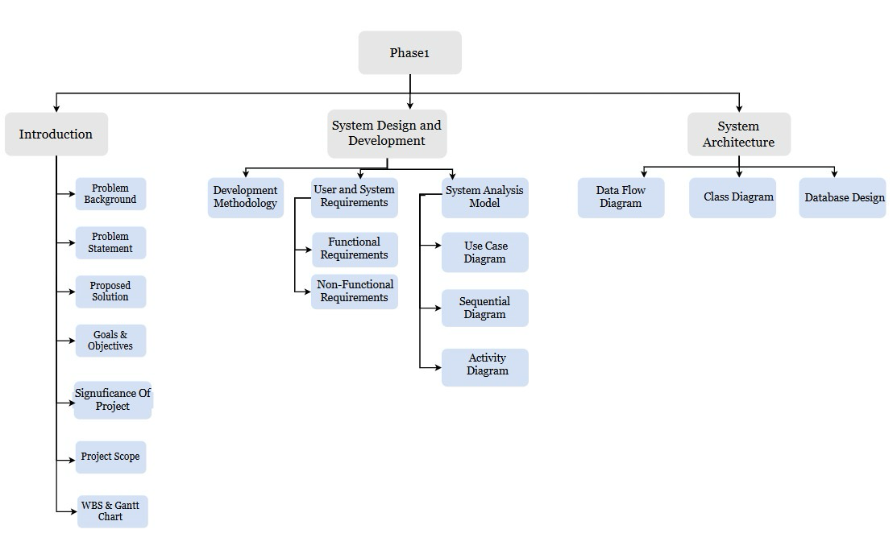

> Figure 1 WBS
>
> **ii. GANTT CHARTS**
>
> The Gantt chart provides a visual representation of the project
> timeline. It helps in tracking the progress of tasks and ensuring that
> the project stays on schedule.

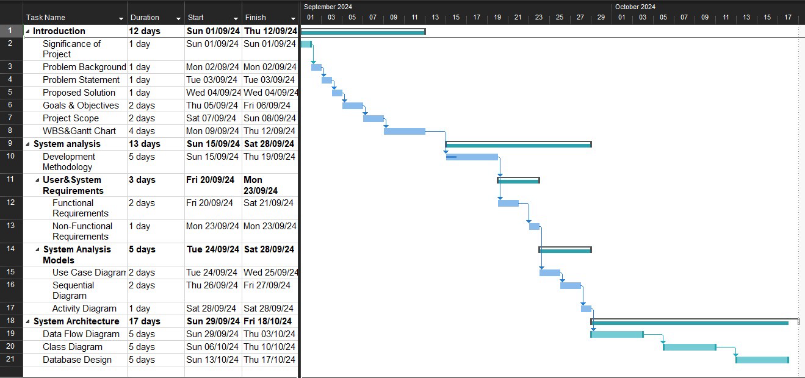

> Figure 2 GANTT CHARTS
>
> CHAPTER 2. System Analysis

**2. System Analysis Models**

**2.1 Development Methodology**

For the development of the Examination Invigilator Assignment System,
the Waterfall methodology will be employed. This approach involves a
linear sequence of stages, making it ideal for projects with
well-defined requirements. Each stage must be completed before moving to
the next, ensuring thorough documentation and clear milestones.

The stages will include:

- Requirements Analysis: Define all functional and non-functional
  requirements for invigilator assignments and conflict detection.

- System Design: Plan the system architecture, including database
  structure for faculty data and scheduling logic.

- Implementation: Develop the system according to design specifications.

- Testing: Verify the system’s performance in assigning invigilators,
  checking for conflicts, and generating reports.

- Deployment and Maintenance: Deploy the system and provide regular
  updates as required.

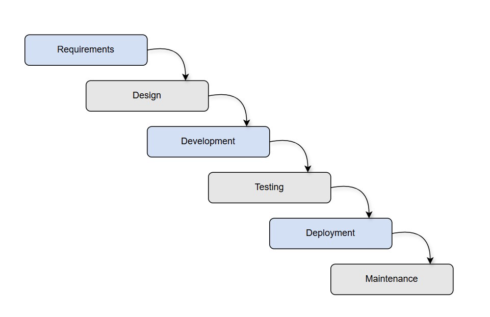

> Figure 3 Development Methodology
>
> **2.2 User and System Requirements**
>
> **2.2.1 Functional Requirements**
>
> The Examination Invigilator Assignment System will include the
> following key functional requirements:
>
> **Invigilator Assignment:**
>
> The system will assign invigilation duties to faculty members based on
> their academic rank and availability. The assignment process will
> consider the number of invigilation per instructor to distribute
> duties fairly.
>
> **Conflict Detection:**
>
> The system will detect scheduling conflicts, such as overlapping
> assignments or double-booking of instructors. Advanced algorithms will
> identify these conflicts and suggest resolutions, ensuring each
> instructor is allocated appropriately without overlaps.
>
> **Committee Access:**
>
> The committee members can log in to the system, input exam schedules
> (courses, rooms, and timings), and modify faculty assignments as
> needed. They will also have access to view and approve the generated
> invigilation schedule.
>
> **Result Notification:**
>
> Once the invigilation schedule is finalized, the system will send the
> result to the committee in the form of a table, showing each
> instructor's assigned duties for the exam period.
>
> **Database Management:**
>
> The system will maintain a database of faculty members, including
> their names and academic ranks, to support fair and accurate
> assignment of duties. This database will be updated each semester with
> new details or modifications.
>
> **Expected Benefits**
>
> **Efficient Invigilation Assignment:** Streamlined scheduling will
> reduce manual effort, providing a fair distribution of duties.
>
> **Conflict-Free Scheduling:** Automated conflict detection ensures
> faculty aren’t double-booked, supporting smooth exam operations.
>
> **2.2.2 Non-Functional Requirements**
>
> The system will adhere to several non-functional requirements to
> ensure reliability and usability:
>
> **Performance:**
>
> The system should assign invigilators within a reasonable time frame,
> especially during peak scheduling periods.
>
> **Scalability:**
>
> The system should handle an expanding number of faculty members and
> exam schedules as the institution grows.
>
> **Usability:**
>
> A simple, user-friendly interface will enable committee members to
> enter exam schedules, make adjustments, and view the final
> assignments.
>
> **Security:**
>
> Data security protocols will protect faculty information and prevent
> unauthorized access to the scheduling system.
>
> **2.3.1 Use Case Diagram**
>
> **Actors:**

- Admin

- System

> **Use Cases for Admin:**

- Login

- Enter Semester Data

- View Final Schedule

- Confirm Final Schedule

- Logout

> **Use Cases for System:**

- Retrieve Faculty Data

- Assign Supervisors

- Conflict Detection

- Store Final Schedule

- Send Final Schedule

> 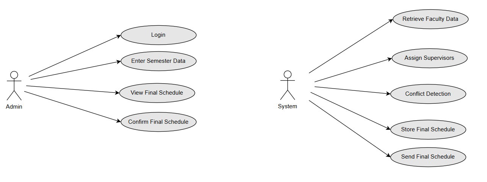 style="width:6.08056in;height:2.61667in" />
>
> Figure 4 Use Case Diagram
>
> **2.3.2 Sequence Diagram**
>
> In software engineering, a sequence diagram shows the interactions of
> processes
>
> arranged in a chronological sequence. This diagram depicts the
> processes, the objects
>
> 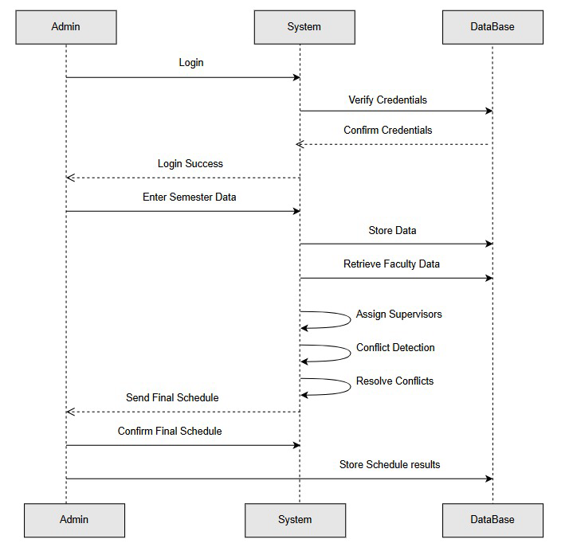 style="width:6.47986in;height:6.90833in" />involved, and the sequence
> of messages exchanged as needed to perform the function.
>
> Figure 5 Sequence Diagram
>
> **Full Steps for the Diagram:**
>
> **1. Admin Logs In:**
>
> Admin sends a login request.
>
> System verifies login credentials through the Database.
>
> Database sends confirmation of credentials to the System.
>
> System responds to Admin with a login success message.
>
> **2. Entering Semester Data:**
>
> Admin enters the course, room, and time data.
>
> System receives and stores this data in the Database.
>
> **3. Assigning Exam Supervisors:**
>
> System retrieves faculty data from the Database, including academic
> ranks and eligible courses for supervision.
>
> System initiates the process of assigning supervisors based on ranks.
>
> **4. Conflict Detection:**
>
> System checks for conflicts, such as overlapping times or rooms.
>
> If conflicts are found, System makes necessary adjustments to resolve
> them.
>
> **5. Storing and Sending Final Schedule:**
>
> System saves the final schedule in the Database.
>
> System sends the final schedule to Admin for review.
>
> **6. Confirming the Final Schedule:**
>
> Admin reviews and confirms the final schedule.
>
> **2.3.3 Activity Diagram**
>
> An activity diagram, a dynamic and integrated aspect of the Unified
> Modeling
>
> Language (UML), is defined as a sophisticated visual representation in
> software
>
> engineering and diverse fields that excels at illustrating the smooth
> flow of activities,
>
> procedures, and processes within complex systems, business workflows,
> or any
>
> dynamic process.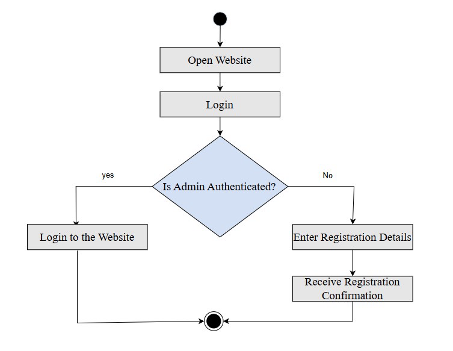 style="width:6.33958in;height:6.37986in" />
>
> Figure 6 Login Activity Diagram .
>
> 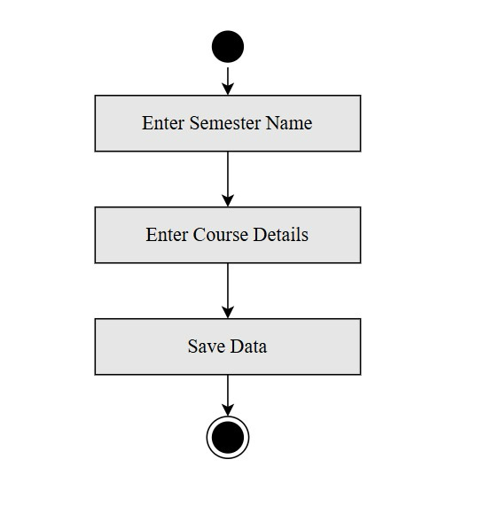 style="width:3.86111in;height:4.02778in" />
> Figure 7 Enter Semester Data Activity Diagram
>
> 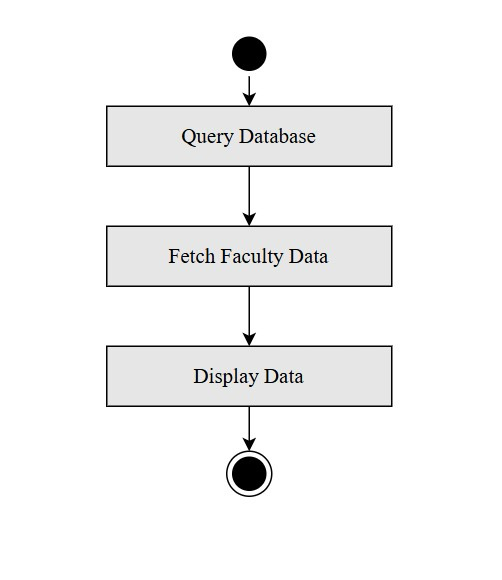 style="width:3.48611in;height:4.02778in" /> Figure 8 Retrieve Faculty
> Data Activity Diagram
>
> 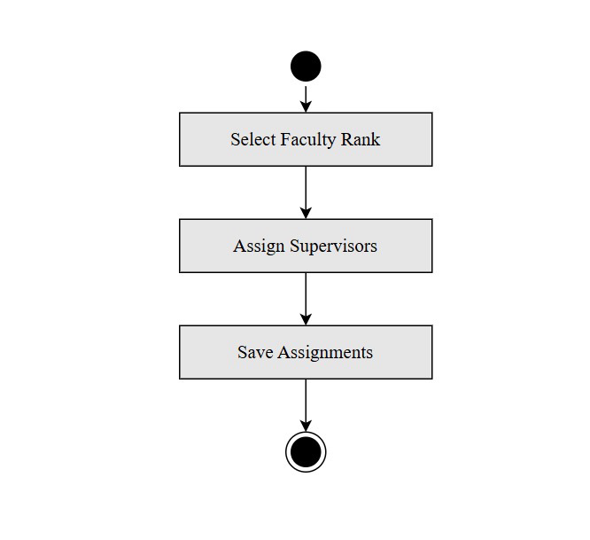 style="width:4.625in;height:4.22222in" />Figure 9 Assign Supervisors
> Activity Diagram .
>
> 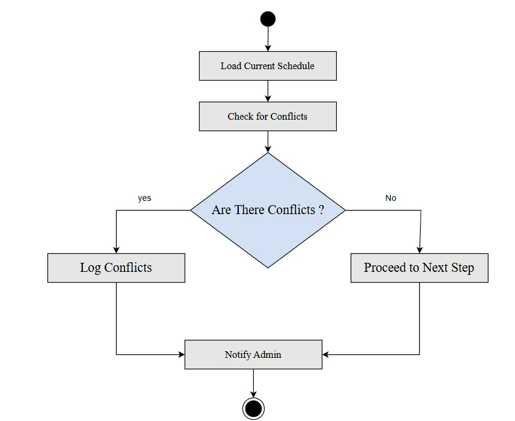 style="width:6.89931in;height:5.64167in" />
>
> Figure 10 Conflict Detection Activity Diagram
>
>  style="width:3.22222in;height:3.16667in" />

Figure 11 Store Final Schedule Activity Diagram

Figure 12 Send Final Schedule Activity Diagram

> 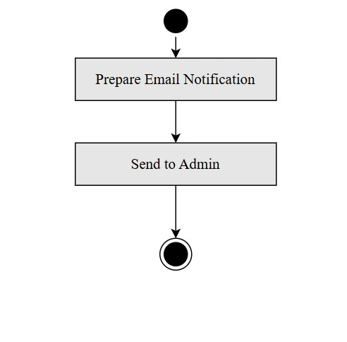 style="width:3.41667in;height:3.36111in" />

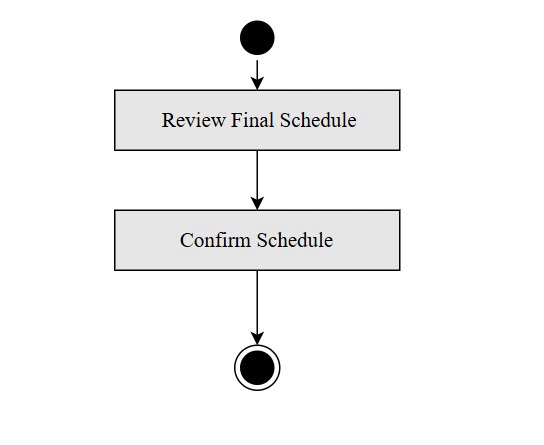

> Figure 13 Confirm Final Schedule Activity Diagram
>
> CHAPTER 3. System Architecture

**3.1 Design system architecture**

Client-server architecture is a fundamental concept in [system
design](https://www.geeksforgeeks.org/what-is-system-design-learn-system-design/) where
a network involves multiple clients and a server. Clients are devices or
programs that request services or resources, while the server is a
powerful machine providing these resources or services

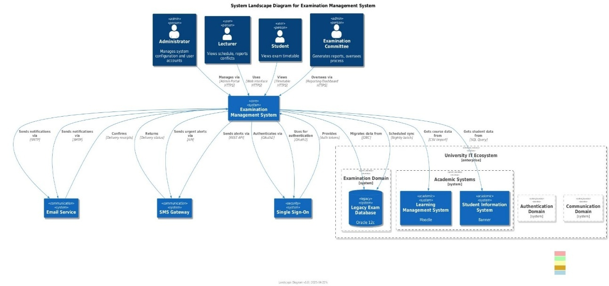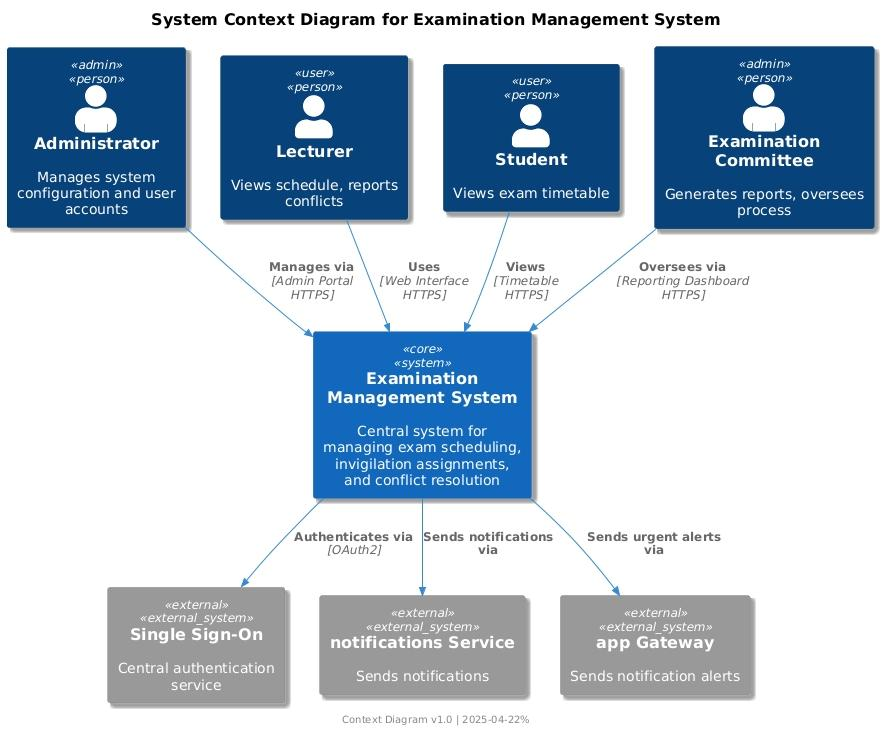

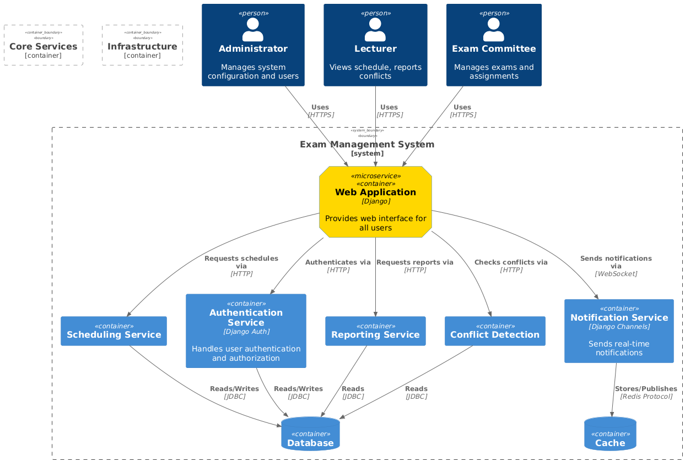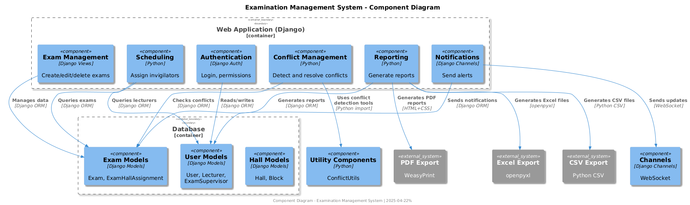.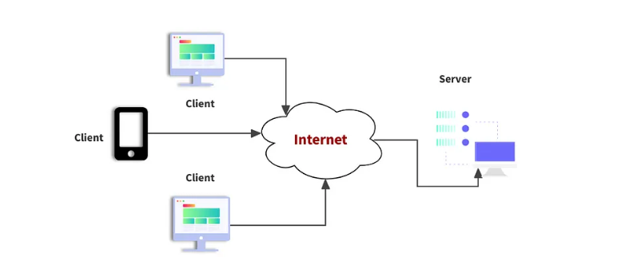

> Figure 14 Design system architecture
>
> 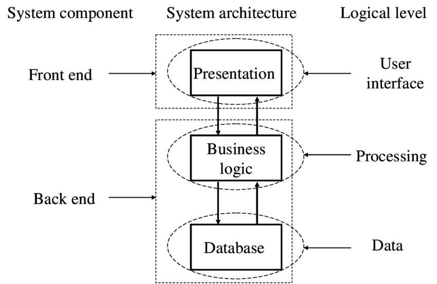 style="width:5.40486in;height:3.52281in" />
>
> Figure 15 Design system architecture
>
> **3.2 Class Diagram**
>
> A Class Diagram is a type of diagram in the Unified Modeling Language
> (UML) used to represent the overall structure of a software system. It
> provides a detailed visualization of the system by illustrating the
> classes (objects) used, the relationships between them, and the
> attributes and methods associated with each class.
>
> This diagram serves as a foundational blueprint for designing software
> systems and plays a critical role in understanding, organizing, and
> implementing complex projects.
>
> 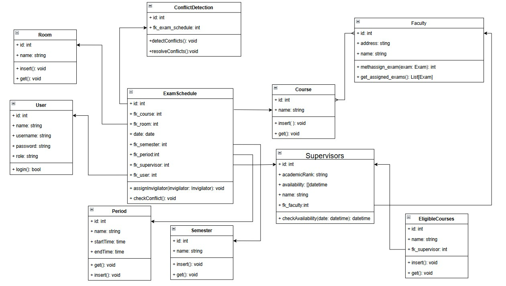 style="width:6.64931in;height:3.95556in" />
>
> Figure 16 Class Diagram
>
> **3.3 Entity Relationship Diagram**
>
> ERD (Entity-Relationship Diagram) is a visual representation used to
> model the relationships between different entities within a system. It
> illustrates how various entities (such as people, objects, or
> concepts) interact with one another through relationships (such as
> one-to-one, one-to-many, or many-to-many). The diagram helps in
> understanding the structure and organization of data by showing how
> different entities are connected and how they depend on each other
> within the context of a system or application. ERDs are useful for
> designing and organizing complex systems and ensuring data flows
> logically.
>
> 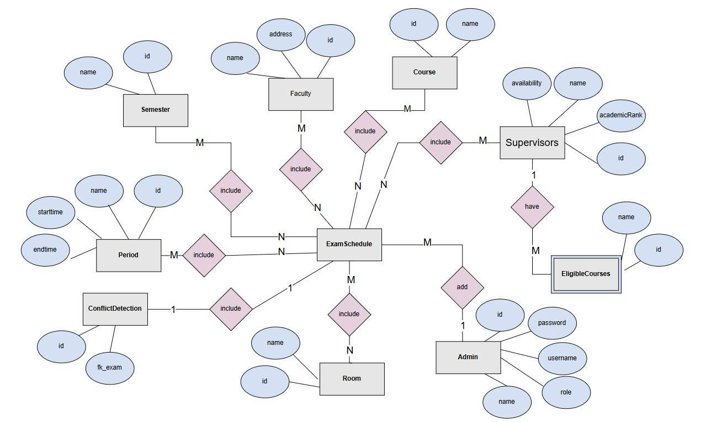 style="width:7in;height:4.16319in" />
>
> Figure 17 Entity Relationship Diagram
>
> **3.4 Data Flow Diagram**
>
> A Data Flow Diagram (DFD) is a graphical representation used to
> visualize the flow of data within a system, including its processes,
> data stores, and external entities. It illustrates how data moves
> through the system, where it is processed, and where it is stored,
> making it easier to understand the system's functionality and identify
> potential inefficiencies .

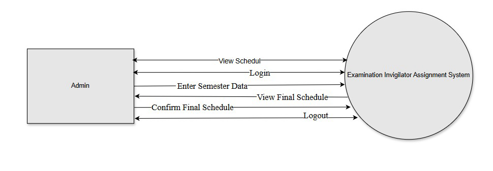

> Figure 18 Data Flow Diagram
>
> 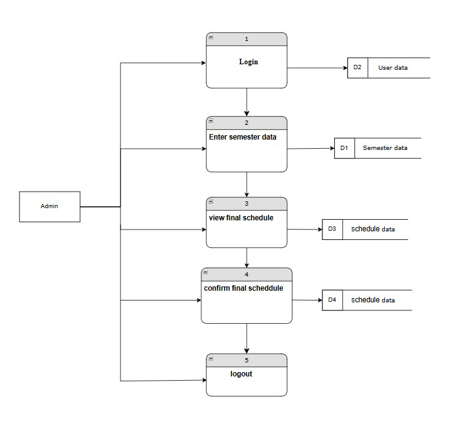 style="width:6.02431in;height:5.45972in" /> Figure 19 Level 0 Diagram
>
> CHAPTER 4. System IMPLEMENTATION

# 

# 4. SYSTEM IMPLEMENTATION

This section describes the transformation of the theoretical design into
a functional system. It explains the hardware and software environment
needed to support the project, outlines the various stages of system
implementation, and provides illustrative code samples that demonstrate
how different components have been developed and integrated.

## 4.1 Required Hardware & Software

The successful implementation of the Examination Invigilator Assignment
System (EIAS) depends on both robust hardware and reliable software. The
project was built as a web‑based application using the Django framework
(as evidenced in the EMS project structure), and the following
subsections detail the essential requirements.

### 4.1.1 Hardware Requirements

#### Processing Unit

To ensure that the system runs efficiently during both development and
production, a high‑performance central processing unit (CPU) is
required. The minimum specifications include a multi‑core processor
(quad‑core or higher) that can handle concurrent processes such as
compilation, testing, and real‑time scheduling computations. For
development work, individual workstations should be equipped with modern
CPUs (e.g., Intel i5/i7 or AMD Ryzen series) capable of multitasking
without significant slowdowns.

#### Memory (RAM)

Adequate Random Access Memory (RAM) is crucial for the smooth execution
of development environments, simulation tools, and server operations. A
minimum of 16 GB RAM is recommended for development machines to support
the integrated development environments (IDEs) such as PyCharm or Visual
Studio Code and to allow multiple applications (including local
databases, browsers, and debugging tools) to run simultaneously. For
production servers, memory requirements can vary based on the expected
load but a baseline of 32 GB is suggested for handling concurrent user
sessions and background processing tasks.

#### Storage

Data storage must be both fast and reliable. Solid State Drives (SSD)
are preferred for development work to reduce boot and load times. For
the production environment, storage solutions should be configured to
handle high I/O operations; SSDs are recommended, although
high‑performance Hard Disk Drives (HDD) can also be considered if cost
constraints dictate. The system requires ample storage not only for the
operating system and application code but also for the relational
database (MySQL) that stores exam schedules, invigilator records, and
system logs.

#### Network Components

Since EIAS is a web‑based system, network infrastructure is a critical
component. This includes reliable routers, switches, and, if applicable,
dedicated servers for hosting the application. The network must support
secure connections via SSL/TLS certificates and be capable of handling
the bandwidth necessary for real‑time notifications, data transfers, and
user interactions. In production, load balancing and redundant network
paths are recommended to ensure high availability and resilience.

### 4.1.2 Software Requirements

#### Operating System

The development and deployment of the EIAS can be carried out on various
operating systems. During development, platforms such as Windows, Linux,
and macOS are supported. For production, Linux distributions (such as
Ubuntu Server or CentOS) are typically preferred because of their
stability, security, and extensive support in server environments.

#### Development Tools & IDEs

Several integrated development environments (IDEs) and tools are
employed throughout the project lifecycle:

- **PyCharm and Visual Studio Code:** These IDEs provide robust support
  for Python and Django development, featuring code auto‑completion,
  integrated debugging, and version control system (VCS) integration.

- **Eclipse:** In cases where additional languages (such as Java) or
  plugins are needed, Eclipse offers a versatile development platform.

- **Git:** For source code management and version control, Git is
  utilized to facilitate collaboration among developers and maintain
  code integrity through branches and pull requests.

#### Database Management System

The system employs a relational database management system (RDBMS) to
store structured data related to exam schedules, faculty details,
invigilation assignments, and more. The following systems are
considered:

- **MySQL or MariaDB:** These are the primary choices given their
  reliability, scalability, and integration ease with Django. The
  database schema, as described in Phase‑1 and reflected in the
  project’s ER diagrams, defines relationships among entities such as
  Lecturer, Exam, Hall, ExamSupervisor, and ExamHallAssignment.

- **PostgreSQL:** An alternative RDBMS option, known for its robustness
  and advanced features, can also be deployed depending on institutional
  preferences.

- **MongoDB or Firebase:** Although NoSQL databases offer flexibility,
  the project requirements favor relational data integrity; however,
  NoSQL options could be explored for specific modules if needed.

#### Programming Languages

The primary programming language used in the project is **Python**.
Python’s clear syntax and extensive library support facilitate rapid
development and integration of complex scheduling algorithms.
Additionally, front‑end elements are developed using:

- **HTML, CSS, and JavaScript:** These core web technologies create a
  responsive, user‑friendly interface that is accessible across multiple
  devices.

- **PHP or C# (if needed):** In scenarios where additional server‑side
  processing is required, these languages can be integrated; however,
  the current project design relies on Python and Django.

#### Testing & Debugging Tools

Robust testing and debugging are vital to ensure that the system meets
both functional and non‑functional requirements. The following tools are
deployed:

- **Selenium:** An automated testing framework for end‑to‑end testing of
  the user interface and to simulate user interactions.

- **JUnit and PyTest:** While JUnit is more common for Java
  applications, PyTest is the preferred testing framework for Python.
  These tools are used for unit testing and regression testing of
  various modules.

- **Postman:** For testing RESTful APIs and ensuring that the
  communication between different components (such as the front‑end and
  back‑end) is seamless.

- **Browser Developer Tools:** These tools facilitate debugging of
  front‑end code and monitoring network activity.

## 4.2 System Implementation

The system implementation phase is characterized by a step‑by‑step
development process that begins with individual module development and
culminates in the full integration of the application. The development
process incorporates industry‑standard methodologies and best practices,
ensuring that the final system meets the rigorous specifications
outlined in the design phase.

### 4.2.1 Module Development

Each functional component of the EIAS is developed as an independent
module. The project’s structure, as seen in the “EMS structure and
codes” file, is modular and follows the Model‑View‑Controller (MVC)
paradigm inherent in Django. The following modules are developed:

- **Authentication Module:**  
  This module implements secure user login, session management, and
  role‑based access control. It leverages Django’s built‑in
  authentication system to manage user credentials and permissions.

- **Scheduling Module:**  
  At the core of EIAS, the scheduling module applies advanced algorithms
  to assign invigilators to exam sessions. It factors in lecturer
  availability, academic rank, and workload distribution. Code snippets
  in the views and models (as shown in the EMS code files) illustrate
  how scheduling conflicts are detected and resolved.

- **Conflict Detection Module:**  
  This module continuously monitors for scheduling conflicts such as
  overlapping exam sessions or double‑booking of invigilators. It uses a
  combination of Python logic and database triggers (where necessary) to
  flag conflicts and trigger notifications.

- **Reporting Module:**  
  This module generates detailed reports on invigilation assignments,
  including statistical summaries, assignment charts, and logs of
  detected conflicts. Reports are accessible via an intuitive dashboard
  and can be exported in various formats.

- **Notification Module:**  
  Real‑time notifications are a key feature of the system. This module
  uses Django Channels to send asynchronous notifications to users when
  there are schedule updates, detected conflicts, or when new
  assignments are made.

### 4.2.2 Integration of Components

After the individual modules have been developed and unit‑tested, the
next step is to integrate them into a cohesive system. Integration
focuses on ensuring that all modules work together seamlessly:

- **User Interface and Backend Integration:**  
  The front‑end, built with HTML, CSS, and JavaScript, is integrated
  with Django views and templates. The UI allows users to interact with
  the system by entering exam details, viewing schedules, and receiving
  notifications. Template files (as observed in the “EMS structure and
  codes” file under the invigilation/templates folder) have been
  structured to present a consistent, user‑friendly experience.

- **Database Integration:**  
  All modules rely on a central database for data storage. Django’s ORM
  (Object‑Relational Mapping) abstracts the database layer, enabling
  seamless interaction with MySQL or PostgreSQL. The integration process
  ensures that models defined for Lecturer, Exam, Hall, and other
  entities are synchronized with the actual database tables. This
  integration was tested by uploading CSV files through the system’s
  upload functionalities and verifying data integrity.

- **API Integration:**  
  For components that require communication over RESTful interfaces, API
  endpoints are created. These endpoints allow the front‑end to retrieve
  real‑time data (e.g., exam schedules and conflict reports) and enable
  external systems (if any) to interface with EIAS.

### 4.2.3 Database Integration

The database is the backbone of the system and must be carefully
integrated with the application logic. Key steps include:

- **Schema Definition:**  
  The relational database schema was designed during Phase‑1, based on
  ER diagrams that outline relationships among all key entities. The
  schema includes primary keys, foreign keys, and indexes to optimize
  query performance.

- **Data Migration:**  
  Django’s migration tools (e.g., manage.py migrate) are used to create
  and update the database schema as the project evolves.

- **Stored Procedures and Triggers:**  
  For critical operations such as conflict detection and automatic
  notifications, stored procedures and triggers have been implemented
  within the database. These ensure that any data modifications (e.g., a
  new exam entry) automatically initiate background processes.

### 4.2.4 Development Methodology

The development methodology for EIAS is chosen based on project
requirements and team dynamics. The following approaches were considered
and applied:

- **Agile Development:**  
  Iterative sprints allow continuous integration of feedback. Each
  sprint focuses on developing, testing, and refining specific modules.
  Daily stand‑up meetings and regular sprint reviews have ensured
  transparency and early detection of issues.

- **Waterfall Elements:**  
  Given the well‑defined requirements from Phase‑1, certain phases (such
  as requirements analysis and initial design) followed a sequential
  approach. However, most of the implementation adopted an agile mindset
  to allow flexibility in addressing unforeseen challenges.

- **DevOps Practices:**  
  Continuous integration and continuous deployment (CI/CD) pipelines
  have been established using tools such as GitHub Actions. Automated
  testing, code reviews, and deployment scripts ensure that every code
  commit is validated and integrated without disrupting the main
  codebase.

## 4.3 Sample Code

In order to illustrate the practical implementation of the system,
selected code excerpts are provided. These examples highlight how
different layers of the application have been implemented.

### 4.3.1 Front-End Development

The front‑end of the system is designed to be intuitive and responsive.
Sample code snippets include:

**HTML & CSS (Dashboard Page):**

\<!DOCTYPE html\>

\<html lang="en"\>

\<head\>

\<meta charset="UTF-8"\>

\<meta name="viewport" content="width=device-width, initial-scale=1"\>

\<title\>Invigilation Management Dashboard\</title\>

\<link
href="https://cdn.jsdelivr.net/npm/bootstrap@5.3.0/dist/css/bootstrap.min.css"
rel="stylesheet"\>

\<link rel="stylesheet"
href="https://cdnjs.cloudflare.com/ajax/libs/font-awesome/6.4.0/css/all.min.css"\>

\<style\>

body { font-family: 'Inter', sans-serif; }

.dashboard-header { margin-bottom: 20px; }

\</style\>

\</head\>

\<body\>

\

\<header class="dashboard-header"\>

\<h1\>Welcome to the Invigilation Management System\</h1\>

\</header\>

\<section id="main-dashboard"\>

\<!-- Dashboard content generated via Django template tags --\>



\</section\>

\</div\>

\<script
src="https://cdn.jsdelivr.net/npm/bootstrap@5.3.0/dist/js/bootstrap.bundle.min.js"\>\</script\>

\</body\>

\</html\>

This code demonstrates the integration of Bootstrap for responsive
design and the use of Django templates to dynamically generate the
dashboard content.

### 4.3.2 Back-End Development

On the back‑end, Python and Django are used to implement business logic.
An excerpt from the views file illustrates the process of creating and
editing exam schedules:

from django.shortcuts import render, redirect, get_object_or_404

from django.contrib import messages

from .models import Exam, Lecturer

from .forms import ExamForm

from django.contrib.auth.decorators import login_required

from channels.layers import get_channel_layer

from asgiref.sync import async_to_sync

from django.urls import reverse

@login_required(login_url='login')

def create_exam(request):

if request.method == "POST":

form = ExamForm(request.POST)

if form.is_valid():

exam = form.save(commit=False)

exam.created_by = request.user

exam.save()

\# Notify users in real-time about the new exam

channel_layer = get_channel_layer()

exam_url = reverse('exam_detail', kwargs={'pk': exam.pk})

async_to_sync(channel_layer.group_send)(

"bulk_notifications",

{

"type": "send.bulk_notifications",

"users": \[user.id for user in Lecturer.objects.all()\],

"message": {

"type": "exam_created",

"message": f"New exam scheduled: {exam.exam_name}",

"exam_id": exam.id,

"link": exam_url,

}

}

)

messages.success(request, "Exam created successfully!")

return redirect('exam_list')

else:

messages.error(request, "Error creating exam. Please check the form.")

else:

form = ExamForm()

return render(request, 'invigilation/create_exam.html', {'form': form})

This sample code shows how the system handles form submissions, data
validation, and asynchronous notifications using Django Channels.

### 4.3.3 Database Queries

The following SQL query illustrates how data is retrieved from the
database. This query might be automatically generated by Django’s ORM,
but it reflects the underlying process:

SELECT exam.exam_name, exam.exam_date, hall.hall_name

FROM exam

JOIN hall ON exam.exam_hall_id = hall.id

WHERE exam.exam_date \>= CURDATE()

ORDER BY exam.exam_date;

This query retrieves upcoming exam schedules along with the assigned
hall names, ensuring that administrators can view current and future
invigilation sessions.

### 4.3.4 API Development

For external communication, RESTful APIs have been developed. Below is
an example of an API endpoint that returns exam details in JSON format:

from rest_framework.decorators import api_view

from rest_framework.response import Response

from .models import Exam

from .serializers import ExamSerializer

@api_view(\['GET'\])

def exam_list_api(request):

exams = Exam.objects.all().order_by('exam_date')

serializer = ExamSerializer(exams, many=True)

return Response(serializer.data)

This endpoint is designed to integrate with third‑party applications or
mobile interfaces, providing real‑time exam schedule data.

> CHAPTER 5. System Testing

# 5. SYSTEM TESTING

System testing is critical to ensuring that the implemented solution is
both functional and robust. In Phase‑2, testing is carried out at
multiple levels to verify individual modules (unit testing) and the
integrated system (integration testing).

## 5.1 Unit Testing

Unit testing focuses on testing individual components or modules in
isolation to ensure that each function performs as expected.

### 5.1.1 Purpose of Unit Testing

The purpose of unit testing is to identify and fix bugs at an early
stage. By isolating modules, developers can verify that each component
(such as the scheduling algorithm, user authentication logic, and
conflict detection module) behaves correctly under various conditions.

### 5.1.2 Automated Testing Frameworks

The following tools and frameworks are employed for automated unit
testing:

- **PyTest:** Utilized for testing Python functions and ensuring that
  modules perform correctly.

- **Django’s Test Framework:** Integrated into the project to test
  models, views, and forms.

- **Mock Libraries:** These are used to simulate external dependencies
  (for example, simulating database responses or third‑party API calls).

### 5.1.3 Sample Unit Test Cases

Examples of unit tests include:

- **Authentication Test:**  
  Verifying that valid user credentials allow access while invalid ones
  are rejected.

> from django.test import TestCase
>
> from django.contrib.auth.models import User
>
> class AuthenticationTest(TestCase):
>
> def test_valid_login(self):
>
> user = User.objects.create_user(username='testuser',
> password='secret')
>
> login = self.client.login(username='testuser', password='secret')
>
> self.assertTrue(login)
>
> def test_invalid_login(self):
>
> login = self.client.login(username='wronguser',
> password='wrongpassword')
>
> self.assertFalse(login)

- **Scheduling Module Test:**  
  Testing that the scheduling algorithm correctly assigns invigilators
  and flags conflicts.

> from django.test import TestCase
>
> from .models import Exam, Lecturer
>
> from .views import schedule_exam
>
> class SchedulingTest(TestCase):
>
> def test_schedule_without_conflict(self):
>
> \# Setup test data for lecturers and exam schedule
>
> lecturer = Lecturer.objects.create(lecturer_name="Dr. Smith",
> lecturer_code="LS001")
>
> \# Assume schedule_exam is a function that returns schedule details
>
> schedule = schedule_exam(lecturer, exam_time="2025-05-10 09:00")
>
> self.assertIsNotNone(schedule)
>
> self.assertNotIn("conflict", schedule)

These tests run automatically on every code commit via the CI/CD
pipeline to ensure that code changes do not introduce regressions.

## 5.2 Integration Testing

Integration testing verifies that multiple modules work together as
expected. This phase involves testing the interactions between the
front‑end, back‑end, and database layers.

### 5.2.1 Integration Test Objectives

- **Data Flow Testing:** Ensuring that data entered via the UI correctly
  flows to the database and is retrieved accurately.

- **Database Connectivity:** Verifying that the application can
  establish and maintain connections with the database.

- **API Integration:** Confirming that RESTful API endpoints communicate
  successfully with external clients and mobile applications.

- **Third‑Party Service Integration:** Testing integration with external
  libraries (e.g., for real‑time notifications).

### 5.2.2 Integration Test Methods

- **Automated End‑to‑End Tests:** Using Selenium to simulate real user
  actions, such as logging in, creating an exam, and viewing the
  dashboard.

- **Manual Testing:** Testers follow detailed test cases to validate
  user workflows, ensuring that navigation, data submission, and error
  handling are all functioning correctly.

### 5.2.3 Sample Integration Test Scenarios

- **User Workflow Test:**  
  A tester logs into the system, creates a new exam schedule, verifies
  that the new exam appears on the dashboard, and then checks the
  database to confirm that the exam data has been stored correctly.

- **API Data Flow Test:**  
  An API call is made to the exam_list_api endpoint, and the response is
  validated against expected JSON data. Any discrepancies are logged and
  investigated.

- **Conflict Detection Test:**  
  Multiple invigilation assignments are created deliberately to simulate
  scheduling overlaps. The system’s conflict detection module should
  identify the conflict and prompt a resolution workflow.

> CHAPTER 6. System DEMONSTRATION

# 6. SYSTEM DEMONSTRATION

The system demonstration is the culminating phase where the fully
integrated and tested system is showcased to stakeholders. This phase
verifies that the system not only meets all design specifications but
also delivers a smooth and user‑friendly experience.

## 6.1 System Screens Snapshots

**6.2 Database Structure**

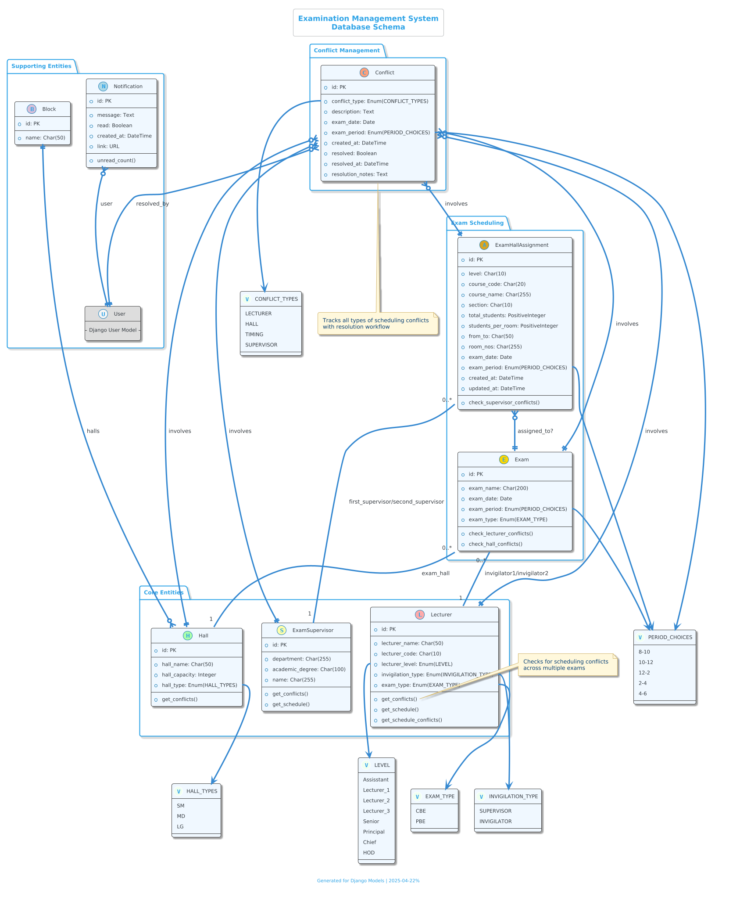

### 

> CHAPTER 7. CONCLUSION & FUTURE WORK

# 7. CONCLUSION & FUTURE WORK

This final section summarizes the outcomes of the project, reflects on
the achievements, discusses any limitations encountered during Phase‑2,
and outlines potential future enhancements.

## 7.1 Summary

> In conclusion, this project is currently at the preliminary stage,
> serving as a draft aimed at researching and developing an examination
> invigilator assignment system using the Waterfall methodology. At this
> stage, the focus has been on conducting the initial analysis of the
> system, including studying the requirements, identifying the core
> functions, and designing the system at a high level. We have developed
> initial diagrams such as the Use Case Diagram and Sequence Diagram to
> illustrate the overall structure of the system and its functionality.
>
> However, it is important to note that this project is still in the
> research and analysis phase. The system presented in this draft
> represents an initial concept based on theoretical analysis and
> outlines the basic plan for future development. In the upcoming stages
> of the project, we will implement the system practically, which will
> involve coding the system, developing interfaces, and testing it in a
> real-world environment.
>
> The practical application of the system will include working with real
> data, ensuring accurate task distribution, assigning invigilators
> properly, and handling timetable conflicts. We will also assess how
> the system responds to actual operational requirements. Additionally,
> the system's performance will be evaluated to ensure it achieves its
> primary goal: improving the efficiency of exam management and
> distributing the workload fairly among faculty members.
>
> In the near future, we will continue to develop the system based on
> these initial foundations, making necessary improvements based on the
> results of real-world testing. This system is expected to
> significantly ease the process of assigning invigilators and achieve
> the highest levels of accuracy and efficiency in academic operations.

The Graduation Project’s Phase‑2 represents the practical realization of
the Examination Invigilator Assignment System (EIAS). The phase
successfully transitioned the project from its conceptual and design
stages (developed in Phase‑1) to a fully implemented, tested, and
demonstrable system.

Key achievements include:

- **Robust System Implementation:**  
  The EIAS has been developed using the Django framework, integrating
  front‑end technologies (HTML, CSS, JavaScript) with a robust
  Python‑based back‑end. The project structure follows best practices in
  software engineering, emphasizing modularity, scalability, and
  maintainability.

- **Comprehensive Hardware & Software Setup:**  
  The system was implemented on a platform with adequate processing
  power, memory, and storage. The chosen software tools—including IDEs,
  database management systems, and testing frameworks—have proven
  effective in supporting the system’s development and deployment.

- **Effective Integration:**  
  Modules developed independently, such as the authentication,
  scheduling, conflict detection, and reporting modules, have been
  integrated seamlessly. The use of Django’s ORM and RESTful API
  endpoints ensures smooth data flow between the front‑end, back‑end,
  and database layers.

- **Rigorous Testing:**  
  Both automated and manual testing regimes were executed to verify that
  each component works correctly and that the system as a whole performs
  reliably. Unit tests, integration tests, and end‑to‑end simulations
  have confirmed that the system meets the specified functional and
  non‑functional requirements.

- **User‑Friendly Interface & Real‑Time Notifications:**  
  The system’s user interface was designed to be intuitive and
  accessible, providing administrative users with clear dashboards,
  interactive forms, and comprehensive reports. Real‑time notification
  mechanisms ensure that users are promptly informed about scheduling
  updates or conflicts.

- **Successful Demonstration and Deployment:**  
  The system was deployed on a secure, high‑availability server, and
  live demonstrations confirmed that the solution can effectively
  automate the invigilation assignment process. Stakeholder feedback has
  been overwhelmingly positive, with particular praise for the ease of
  use and operational efficiency.

Overall, the EIAS not only addresses the core challenges of manual
invigilation scheduling but also lays the foundation for future
enhancements that could further optimize and scale the system.

## 7.2 Limitations and Future Work

Despite the many successes of Phase‑2, several limitations were
identified, and avenues for future work have been proposed.

### 7.2.1 Limitations

- **Complexity in Scheduling Algorithms:**  
  While the current scheduling algorithm successfully assigns
  invigilators based on availability and academic rank, it could be
  further refined to incorporate more complex constraints (such as
  dynamic faculty preferences or real‑time availability updates). There
  is also room for improvement in handling unexpected changes (e.g.,
  last‑minute cancellations).

- **Scalability Constraints:**  
  Although the system is designed to scale, stress testing has revealed
  potential bottlenecks under extremely high loads. Future iterations
  may require enhanced caching strategies, database optimizations, and
  distributed computing techniques to maintain performance as the user
  base grows.

- **User Training and Adoption:**  
  The success of the system depends on effective user training. Some
  users have expressed the need for more detailed documentation and
  hands‑on training sessions to fully utilize all features of the
  system.

- **Limited Mobile Compatibility:**  
  The current design primarily targets desktop and web‑browser
  environments. A mobile‑optimized version or dedicated mobile
  application could significantly enhance accessibility and user
  experience for on‑the‑go administrators.

### 7.2.2 Future Enhancements

To further improve the EIAS, the following enhancements are proposed:

- **Advanced Scheduling with Machine Learning:**  
  Future work could incorporate machine learning algorithms to analyze
  historical scheduling data and predict optimal invigilation
  assignments. This enhancement could automatically adjust assignments
  in real time based on evolving conditions.

- **Enhanced Mobile Support:**  
  Developing a responsive mobile interface or a dedicated mobile
  application would allow users to manage invigilation schedules from
  any device. This would increase system accessibility and facilitate
  on‑the‑go decision‑making.

- **Integration with Institutional Systems:**  
  Integrating the EIAS with other institutional systems, such as human
  resource management or academic scheduling tools, would enable
  real‑time data synchronization and further reduce manual data entry.
  This integration would also enhance the accuracy of invigilation
  assignments by ensuring that the latest faculty and exam data are
  always available.

- **Expanded Reporting and Analytics:**  
  Future enhancements could include more detailed analytics dashboards
  that use interactive visualizations. This would allow administrators
  to analyze trends, predict workload distributions, and identify
  potential conflicts before they occur.

- **Improved Security and Compliance:**  
  As data privacy regulations evolve, the system should incorporate
  advanced security features, such as multi‑factor authentication,
  regular security audits, and enhanced encryption methods. These
  improvements will help maintain data integrity and comply with
  emerging legal requirements.

- **User Feedback Integration:**  
  Implementing a feedback module within the system could allow users to
  submit suggestions or report issues directly. This continuous feedback
  loop would drive iterative improvements and ensure that the system
  evolves according to user needs.

> **References :**

- <https://www.google.com.sa/books/edition/SELECTION_OF_OPTIMAL_SOFTWARE_DEVELOPMEN/-NX7DwAAQBAJ?hl=ar&gbpv=1>

- <https://www.google.com.sa/books/edition/Use_Case_Modeling/zvxfXvEcQjUC?hl=ar&gbpv=0>

- <https://www.google.com.sa/books/edition/Non_functional_Requirements_in_Systems_A/U7-pCAAAQBAJ?hl=ar&gbpv=1&dq=Functional+requirement&pg=PA46&printsec=frontcover>

- <https://www.google.com.sa/books/edition/System_Architecture_Design_and_Platform/2YNyEAAAQBAJ?hl=ar&gbpv=1&dq=design+system+architecture&pg=PA23&printsec=frontcover>

- <https://www.cin.ufpe.br/~in1008/aulas/A%20Comparative%20Analysis%20of%20Entity-Relationship%20Diagrams.pdf>

- <https://www.sciencedirect.com/science/article/pii/S0167642313003092>

- <https://www.researchgate.net/profile/Xiaoshan-Li-3/publication/4071306_A_formal_semantics_of_UML_sequence_diagram/links/09e41507be7aa897e6000000/A-formal-semantics-of-UML-sequence-diagram.pdf>

- <https://arxiv.org/pdf/1011.0278>

- <https://www.researchgate.net/profile/Muhammad-Ikram/publication/287520860_Testing_from_UML_Design_using_Activity_Diagram_A_Comparison_of_Techniques/links/56776ed608ae125516ec0db7/Testing-from-UML-Design-using-Activity-Diagram-A-Comparison-of-Techniques.pdf>
